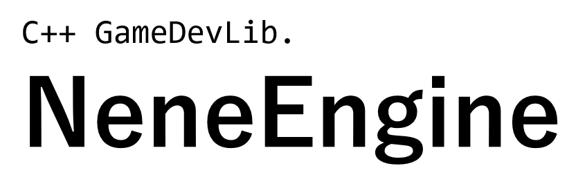
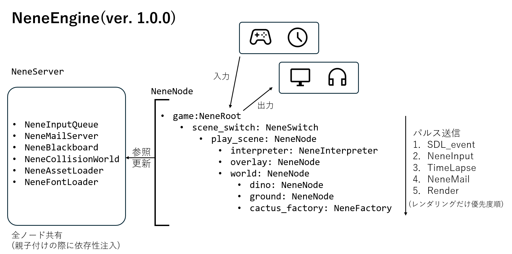

# NeneEngine
ねねエンジンへようこそ! ねねエンジンはC++でゲームを作るためのライブラリです!

デモ: `.\build\Debug\ChromeDino.exe`

**ねねエンジンのここがすごい!**
- CUIなのでAI-friendly!
- 自由な部分木で単体テスト可能!
- パルス遮断器による柔軟なリソース管理!
- 様々な可視化関数による強力なデバッグ支援!
- あらゆる需要を考慮したスケーラブルな設計!
- ノード単位に分割されているのでテンプレートの再利用性抜群!

## ねねエンジンの仕組み

###  ファイル構成
- NeneNode.cpp(.hpp)  
    基幹システム. NeneServerをinclude(唯一の依存関係)
- Neneserver.cpp(.hpp)  
    ノードが共有的に使うサービス. 親から子へ注入される
- NeneComponents.hpp  
    ノードが専有的に使うクラスや構造体. 状態を持つものだけ
- NeneUtilities.hpp  
    便利な関数. 計算だけする. 今は何もない

## NeneNodeGallery
ノードのテンプレートなどをまとめたHTML.

[NeneNodeGallery](./NeneNodeGallery/main.html)

↑ ソースコードが開く. ブラウザで表示してほしいのに...

## リリースノート

### ver. 1.0.0

## TODO
### 新しいパルス: `NeneInput`
1. SDL_event
2. NeneInput
3. TimeLapse
4. NeneMail
5. render

SDLイベントを内部入力に翻訳することで, キーコンフィグに対応できるようにしたい. しかし, それをNeneMailでやるとタイムラプスの後ろにある都合で1フレームずれる可能性がある. そこで, SDLイベントとタイムラプスの間に内部入力を流すための新しいパルス「NeneInput」を追加する.

それに伴って黒板にキーコンフィグを追加する.

あとついでに他のパルスもkeyスナップショット方式にする.

### ノード
- 入力通訳ノード `NeneInterpreter`  
    SDLイベントをNeneInputに変換する. PlaySceneの直下にいて, sdlイベントを通訳し続ける(e.g., スペースキー押下→"jump"). こうすることで, PlaySceneが消えたり凍結したりすると自動的に止まる(タイトルシーンでスペースキーを押すことはジャンプを意味しない). 通訳の際には黒板のキーコンフィグを参照する. 他のノードがキーコンフィグを書き換えると, それに伴って通訳も変わる.
### サーバ
- セーブサービス `NeneSave`
### コンポーネント
- アニメーション制御装置 `NeneAnimator`
- 時間管理装置 `NeneTimer`
- 
