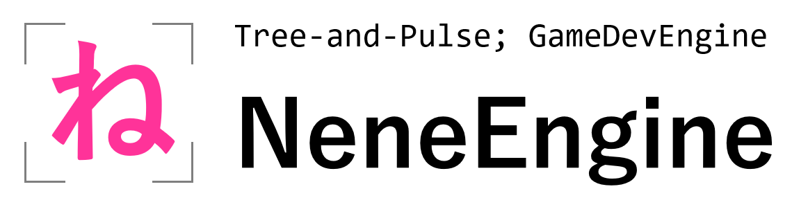
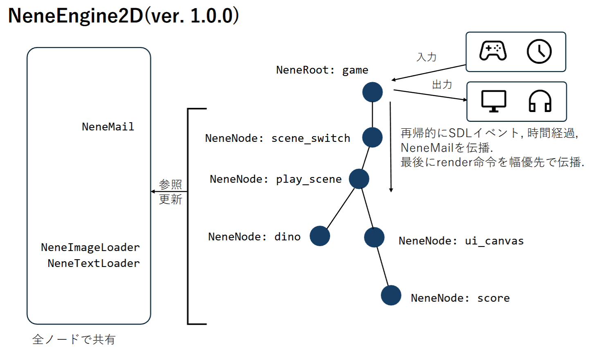

<!--  -->
# NeneEngine
ねねエンジンへようこそ! ねねエンジンはC++でゲームを作るためのライブラリです.
## ねねエンジンの仕組み

## NeneNodeGallery
[NeneNodeGallery](./NeneNodeGallery/main.html)
↑ ソースコードが開く. ブラウザで表示してほしいのに...

## リリースノート

### ver. 1.0.0
- 基本的な「木構造+再帰伝播」方式の仕組みを実装しました.
- キャッシングロード装置, アセットローダーとフォントローダーを実装しました.
- 内部イベント伝送システム `NeneMail` を実装しました.

## TODO
### ノード
- 物理演算オブジェクト `NenePhysicalObject` (重力と衝突判定を受ける)
### サーバ
- 衝突判定装置 `NeneCollisionWorld`
- 設定記憶装置 `NeneSetting`
- セーブ装置 `NeneSave`