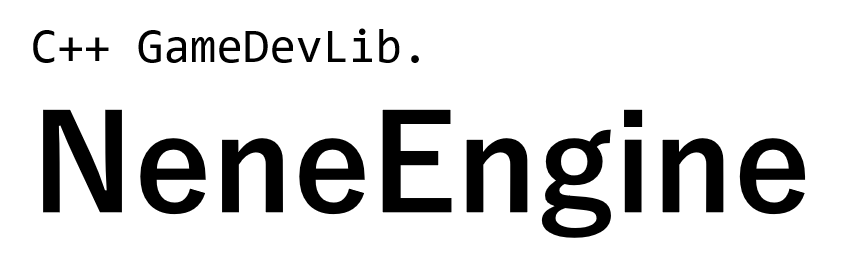
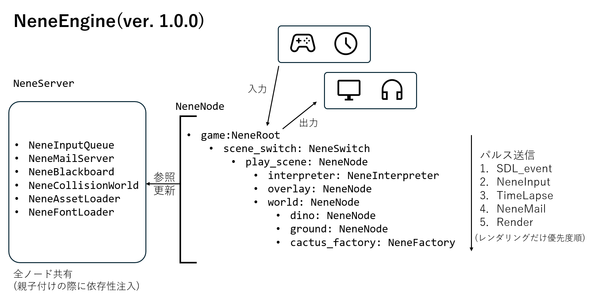

# NeneEngine
ねねエンジンへようこそ! ねねエンジンはC++でゲームを作るためのライブラリです!

デモ: `.\build\Debug\SuperChromeDino.exe`

**ねねエンジンのここがすごい!**
- CUIなのでAI-friendly!
- 自由な部分木で単体テスト可能!
- パルス遮断器による柔軟なリソース管理!
- 様々な可視化関数による強力なデバッグ支援!
- あらゆる需要を考慮したスケーラブルな設計!
- ノード単位に分割されているのでテンプレートの再利用性抜群!

## ねねエンジンの仕組み

###  ファイル構成
- NeneNode.cpp(.hpp)  
    基幹システム. NeneServerをinclude(唯一の依存関係)
- Neneserver.cpp(.hpp)  
    ノードが共有的に使うサービス. 親から子へ注入される
- NeneComponents.hpp  
    ノードが専有的に使うクラスや構造体. 状態を持つものだけ
- NeneUtilities.hpp  
    便利な関数. 計算だけする. 今は何もない

## NeneNodeGallery
ノードのテンプレートなどをまとめたHTML.

[NeneNodeGallery](./NeneNodeGallery/main.html)

↑ ソースコードが開く. ブラウザで表示してほしいのに...

## リリースノート

### ver. 1.0.0

## TODO
- セーブ時, ロード時, セーブデータ消去時にnnlogで通知
    - もっと言うとセーブデータを格納しているフォルダの現状が分かりにくいので簡単に確かめられるようにしたい. (セーブデータの位置わかりにくいし階層が深いのでアクセスしにくい)
- アニメーション実装のサポート -> NeneAnimatorの設計・実装
- 汎用ステートマシンの活用 -> NeneStateMachine
- SuperChromeDino
    - SE, BGM
    - 一時停止
    - ゲームパッド入力

### Demo
- アクション(ゲーム制作の基本) 「SuperChromeDino」
- rpg(外部ツール連携: タイルマップ(Tiled), ダイアログシステム(ink)) 「DinoQuest」
- ミニゲーム集「DinoParty」
    - スイカゲーム(物理演算)
    - イワヤマトンネル・エスケープ(ステルスゲーム+サウンドプログラミング)
    - リズムゲーム(サウンドプログラミング+リズム同期)
    - 倉庫番(パズルロジック+タイルマップ)
    - ミニオセロ(ターン制ゲームロジック+対戦AI)
    - 株価予想ゲーム(インターネット接続+HPバー)
